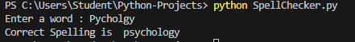
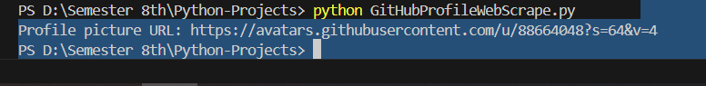

Project Name: Print Emojis Using Python Programming Language
Emojis are used to express our emotions while writing a message or any piece of text. If you want to learn how to display imojis in the output using python.
Print Emojis using python 
Smiling, thumbs up, and the heart emoji are some of the emojis we often use while texting our friends or collegues.

To print emojis using Python, you need to install the emoji module in your python virtual environment. You can easily install it by using the pip command on your terminal 

pip install emoji 

The emoji.emojize method helps you write the description of any emoji inside "::" While writing a piece of text. Below are examples are of descriptions of some of the popular emojis

1. :thumbs_up:
2. :red_heart:
3. :smiling: 

You can use the descriptions of any emoji inside "::" to print the emoji using Python. You can find the descriptions of all the emojis [Here](https://carpedm20.github.io/emoji/)

Now let's a have a look at an example of how to print emojis using Python.

The Code is Given as Under:
import emoji
print(emoji.emojize("I love reading books:books:"))
print(emoji.emojize("Some people have a very sensitive heart :infinity:, Please be kind with them. :hibiscus:"))
print(emoji.emojize("Weldone, My here you are done a Good Job! :thumbs_up:"))

Output given as under:
I love reading books📚
Some people have a very sensitive heart ♾️, Please be kind with them. 🌺
Weldone, My here you are done a Good Job! 👍

Summary 
Emojis are used to to express our emotions while writing a message or any piece of text. To print any emoji using Python, you need to install the emoji module in your Python virtual environment. I hope you liked this article on displaying the emojis in the output using Python programming language. Feel Free to ask valuable questions.


# Correct Spelling Using Python

Correct spelling is a piece of text is one of the handy features that can be used in any application where users write content. For example, if you want to create a notepad, if should have features to identify, and correct the wrong spellings. So, if you want to learn how to correct spellings using the Python programming languages, this article is for you. This article will introduce a handy tool to correct spelling using Python

# Correct Spellings using Python

The SpellChecker Module in Python is one of the handiest tools that can be used to correct misspelt words in a piece of text. If you have never used this module before, you can easily install it in your Python virtaul environment by running the command mentioned below in your command prompt or terminal:

# pip install pyspellchecker

Now below is how you can use this module to correct any misspelt words using python

from spellchecker import SpellChecker

corrector = SpellChecker()

word = input("Enter a word : ")

if word in corrector:
 print("Correct")
else:
 correct_word = corrector.correction(word)
 print("Correct Spelling is ",correct_word)

 Output of Code is given as under:
 

There are many alternatives in Python for the same task, but the spellchecker module is easy to use compare to other [alternatives](https://thecleverprogrammer.com/2020/12/18/spelling-correction-with-python/)

Summary
So this is how you can correct any misspelt word using the Python programming language. Correcting misspelt words in a piece of text is one of the handy features that can be used in any application where user write content. I hope you liked this article on how to correct spellings using python. Feel free to ask valuable questions through my email alisikandarlaghari@gmail.com


# Scraping GitHub Profile using Python

Web Scraping is one of the most valuable skills every coder should have. If you want to learn how to collect data from Github using web scraping techniques, this article is for you. I will take you through a web scrapping tutorial on scraping GitHub profile using Python.

# Scraping GitHub Profile Using Python

When we open any GitHub account, we see a profile picture, the name of the user, and a short description of the user in the profile section. Here you  will learn how to scrape your GitHub profile image. For this task you need some knowledge of HTML and the requests and BeautifulSoup  libraries in Python.

If you have never used the BeautifulSoup library before, use the command mentioned below in your command prompt or terminal to install this library in your python virtual Environment.

# pip install beautifulsoup4

You don't need to install the requests library as it is already present in the Python Standard library. Now below is how to write Python a program to a profile image from any GitHub Profile.

# Git Profile Picture Scraper
This python script  fetches the profile picture URL from a specified GitHub Profile using web scraping. It uses 'requests' to retrieve the HTML content of the profile page and 'BeautifulSoup' to parse and extract the profile image URL.




#Visualize Linear Relationship Using Python

A linear relationship is a statistical term that is nothing but the relationship between two variables. A linear relationship shows how well two variables x and y are related to each other. As a data science professional, you should know how to visualize a linear relationship as it will show the relationship between two numerical features of a dataset. So if you want to learn how to visualize a linear relationship, this article is for you. In this article, I will take you through a tutorial on how to visualize a linear relationship using Python.


# Visualize a Linear Relationship using Python

When the value of variable increases or decreases with the increase or decrease in the value of another variable. then it is nothing but a linear relationship. When we visualize a linear relationship, It shows whether the relationship between two features is linear or not. 


You can use any data visualization library in Python to visualize a linear relationship. I prefer to use  plotly as it provides interactive results. But as so many Python Programmers use matplotlib for data visualization, I will show you how to visualize a linear relationship with Python using plotly and matplotlib

# Visualize Linear Relationships using Python

Here's how to visulize linear relationships by using the plotly library in python.

To  visualize a relationship using matplotlib, you have to use seaborn.regplot method. So here's how to plot linear relationships by using the matplotlib library in Python. 


 Update README File for this project.

# Instagram Data Analysis: Releationship between Likes and Impressions 

This project performs an analysis of the relationship between **Likes** and **Impressions** on Instagram using a dataset. The code visualizes the coorelation between these two variables using **plotly** and **Seaborn** for interactive and static plots, respectively.

# Project Overview:
The analysis demonstrates the linear relationship between the number of **Impressions** and the **Likes** on Instagram posts. We use two type of visualization 

**Plotly Scatter plot** with trendline: An interactive plot that shows the relationship and adds a trendline to visualize the correlation.
**Seaborn Regression plot**: A static plot to observe the regression line between the two variables.

## Requirements 
Before running the code 


## Generate Text Using Python 

Text generation involves generating text using machine learning techniques. The purpose of text generation is to automatically generate text that is indistinguishable from a text written by a human. If you want to learn how to generate text with Python, this article is for you. In this article, I will walk you through how to use the popular GPT-2 text generation model to generate text using python.

# What is GPT-2 Model?
GPT-2 stands for Generative Pretrained Transformer.It is an open source Natural Language Processing model created by OpenAI. It can generate paragraphs of text with the state of the art performance on many language benchmarks. It is also used for machine translation, question anwering, and text summarization. 

To use the GPT-2 model to generate text using python, you need to install the Transformers library in Python. It can be easily installed using the pip command on your command prompt or terminal as mentioned below.

# pip install transformers

I hope you now have have understood what GPT-2 model is and how you can install it in your Python virtual environment. You can read more about this model ['here'](https://openai.com/index/better-language-models/). Now in the section below, I'll explain how you can use this model for generating text using Python.

# Text Generation using Hugging Face Transformers

This project demonstrates text generation using the Hugging Face Transformers library. Specifically, it shows how to use a pre-trained language model (e.g., GPT-2) to generate text based on a given prompt.

## Requirements

- Python 3.7+
- Hugging Face Transformers library
- PyTorch

Install the necessary libraries by running:

```bash
pip install torch transformers


Usage
The following code snippet loads a pre-trained language model and tokenizer from Hugging Face, generates text based on a given prompt, and outputs multiple text variations.

from transformers import pipeline

# Load pre-trained text generation pipeline
model = pipeline("text-generation", model="gpt2")

# Generate text
sentence = model(
    "Hi, My name is Sikandar Ali, I am here",
    do_sample=True,
    top_k=50,
    temperature=0.9,
    max_length=100,
    num_return_sequences=2
)

# Output the generated text
for i in sentence:
    print(i["generated_text"])


Parameters
do_sample: Enables sampling; without it, the model would use greedy decoding.
top_k: Limits sampling to the top k tokens with the highest probabilities.
temperature: Controls the randomness of predictions by scaling the logits.
max_length: Specifies the maximum length of the generated sequence.
num_return_sequences: Specifies the number of generated sequences to return.


## Scrape Table from a Website using Python

Web scrapping is one of the skills that every data science professional should know. Sometimes the data we need is available on a website in the form of a table which cannot be downloaded directly from the website. To use that data for any data science task, we need to collect it from the website using web scraping techniques. So if you want to learn how to scrape a table from Website, this article is for you. In this article, I will take you through a tutorial on how to scrape a table from a website using Python.

Scrape Table From Python

There are many Python libraries and modules thaty you can use for web scrapping. To Scrape a table from a website, I will use **urllib** module in python, which is already available in Python standard library. So you don't need to install any external library to scrape data from website. Below is how you can use urllib module to scrape a table from a website using Python Programming language. 

import urllib.request

import pandas as pd

url = 'https://en.wikipedia.org/wiki/Programming_languages_used_in_most_popular_websites'

with urllib.request.urlopen(url) as i:
    html = i.read()
data = pd.read_html(html)[0]


print(data.head())


In the code above, I am collecting data from a table available on a webpage that contains a table describing the programming languages used in most popular companies. You can see the we have received after web scraping is about the programming languages and databases being used by companies. So this is how you can scrape tables from any website using the Python programming languages.

If you want to save this data in a CSV file, below is how you can save it:
data.to_csv("programming.csv")

After running the above code, you will see the CSV file saved on the same directory where your python file is. 


Summary:
So, this is how we can scrape tables from a website using Python. Web Scraping is one of the skills that every datascience professional should know. I hope you liked this article on scraping tables from website using Python. Feel free to ask valuable questions in the comments section below


READ ME FILE for this project.
This project fetches a table of programming languages used in the most popular websites from Wikipedia, processes it using Pandas, and saves it as a CSV file.

Files
script.py: The Python script containing the code to fetch and save the data.
programming.csv: The output CSV file containing the table of programming languages used in popular websites.
Requirements
Python 3.x
Pandas library for data handling and processing.
Usage
Install the Pandas library if it's not already installed:

bash
Copy code
pip install pandas
Run the script:

bash
Copy code
python script.py
The script will:

Fetch data from Wikipedia's "Programming languages used in most popular websites" page.
Extract the first table found on the page.
Save the table as programming.csv.
Code Explanation
Import Modules:

urllib.request is used to open and read the URL.
pandas is used to read and process HTML tables.
Fetch and Read HTML Table:

The script fetches the HTML content from the specified Wikipedia URL.
pd.read_html reads all tables and retrieves the first table.
Save as CSV:

The retrieved table is saved as programming.csv.
print(data.head()) displays the first few rows of the table in the console for verification.

Extract text from PDF using Python
Sometimes a Python developer needs to collect some text information from PDF files. So extracting  text from a PDF is a problem you should know how to solve as a Python developer. If you want to learn how to extract text from a pdf file, this article is for you. In this article, I will take you through a tutorial on how to extract text from pdf with Python.

Extract text from pdf with Python. 

You must know how to collect text from pdf as a Python developer. This skill is useful when a working with resumes. Extracting text from a pdf file is not a difficult task at all. For this task, you need to install python library known as PyPDF2.

You can easily install this Python library using the pip command in your terminal or command prompt as mentioned belwo:
# pip install pypdf2

After installing this python library, we are all prepared for extracting text from any pdf file. Below is how you can extract text from any pdf file using the Python Programming language. 

import PyPDF2

pdf = open("ML_Project_Proposal.pdf", "rb")

reader = PyPDF2.PdfReader(pdf)

page = reader.pages[0]
print(page.extract_text())

In the fourth line of above code, the .pages[] will help you specify the page number you want to extract from.

# Summary:

So this is how you can collect text from a PDF is a problem you should know how to solve as a Python developer. I hope you liked this article about extracting text from PDF files with Python. Feel Free to ask valuable questions in the comments section below.


Pure README.md content for this project 

PDF Text Extraction Script
This script reads and extracts text from the first page of a PDF file using the PyPDF2 library.

Files
script.py: The Python script containing the code to read and extract text from a PDF file.
ML_Project_Proposal.pdf: The PDF file from which text will be extracted.
Requirements
Python 3.x
PyPDF2 library for PDF reading and text extraction.
Usage
Install the PyPDF2 library if it's not already installed:

bash
Copy code
pip install PyPDF2
Place the PDF file (ML_Project_Proposal.pdf) in the same directory as script.py.

Run the script:

bash
Copy code
python script.py
The script will:

Open the specified PDF file in read-binary mode.
Use PyPDF2 to read the file.
Extract and print the text from the first page of the PDF.
Code Explanation
Import Modules:

PyPDF2 is used to open and extract text from PDF files.
Open and Read PDF:

The script opens ML_Project_Proposal.pdf in binary mode.
PyPDF2.PdfReader reads the file and loads all pages.
Extract Text:

The script extracts text from the first page using page.extract_text() and prints it to the console.


